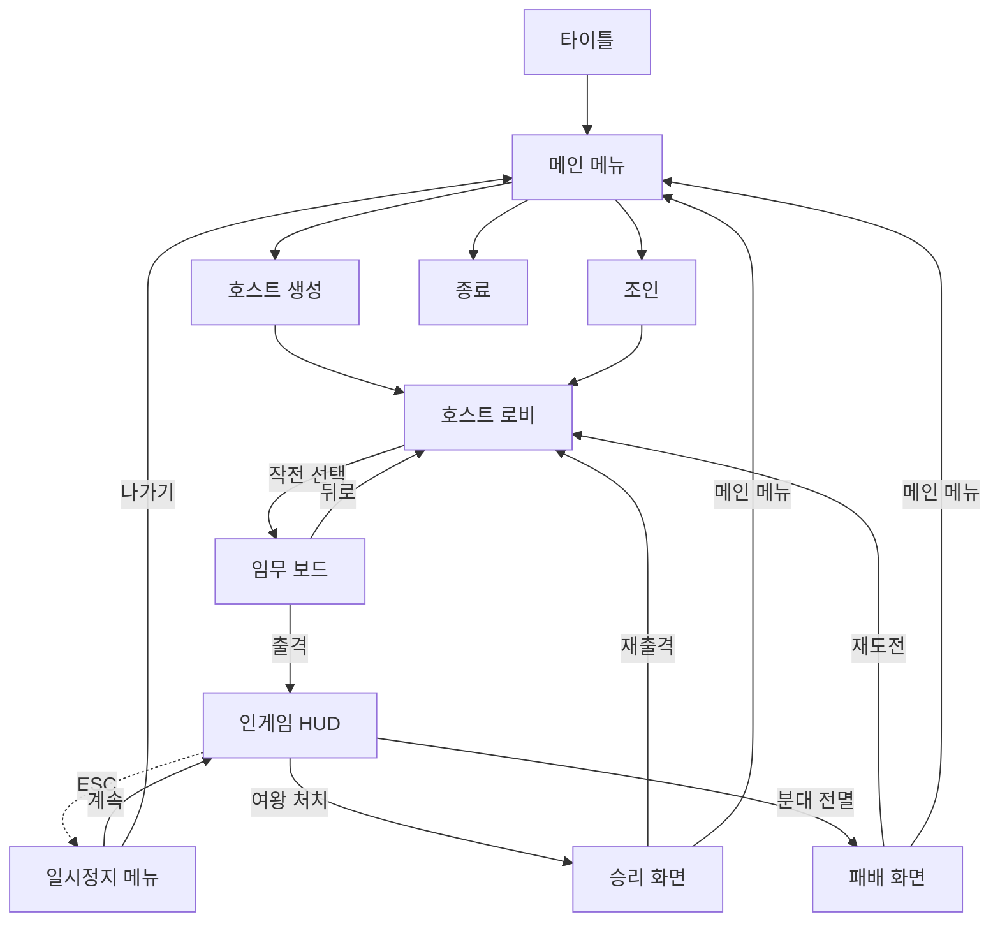

# 외계인 보스 협동 슈터 (가제) — GDD v0.3

> **본 프로젝트는 "게임 완성"보다 "언리얼 네트워크 모델 학습"을 1차 목적으로 한다.**
> 모든 시스템은 클라이언트-서버 패턴을 학습할 수 있도록 의도적으로 배치되어 있다.

> **v0.3 변경점**: 학교 제출 양식(장르·게임방식·세계관·캐릭터 설정·화면기획)에 맞춰 섹션 순서 재구성. 세계관(§3), 캐릭터 설정(§4), 화면기획(§5) 신규 작성. 기술 사양은 §6으로 이동.

---

## 1. 프로젝트 개요

### 1.1 컨셉 한 줄
탑뷰 시점, 1~4인 협동, 짧은 잡몹 구간을 거쳐 외계인 여왕과 맞서는 보스 러시 슈터. *Alien Swarm* 분위기 차용.

### 1.2 핵심 정보
| 항목 | 값 |
|------|----|
| 엔진 | Unreal Engine **5.7** |
| 플랫폼 | Windows PC |
| 장르 | 탑뷰 협동 슈터 (Co-op Top-Down Shooter) |
| 인원 | 1~4인 (싱글 가능, 리슨서버 호스트) |
| 개발 기간 | 2주 |
| 개발 인원 | 1인 (개인 과제) |
| 베이스 템플릿 | UE5 Top Down (Variant_TwinStick 활용) |
| 저장소 | GitHub (Git LFS) |

### 1.3 제작 동기

> **TODO (v0.4에서 보강 예정)**: 학습 목적 + "출시한다면" 관점의 동기를 함께 정리. 현재는 §1.4 학습 목표가 그 역할을 일부 수행.

### 1.4 학습 목표 (이게 진짜 목표)
외형은 슈터지만, 본질은 **언리얼 네트워크 시스템을 실제 게임 로직 위에서 굴려보는 학습 키트**다. 발표 시 "이거 만들면서 뭘 배웠나"를 명확히 답할 수 있어야 한다.

- 권위 모델 (`HasAuthority`, `GetLocalRole`, `ROLE_Authority` / `AutonomousProxy` / `SimulatedProxy`)
- 변수 리플리케이션 + `RepNotify`
- RPC 세 종류 (`Server`, `Client`, `NetMulticast`)와 Reliable / Unreliable 선택 기준
- 클라이언트 예측 + 서버 보정 (`CharacterMovementComponent`)
- AI / 게임 흐름의 서버 권위
- `GameMode`(서버 전용) vs `GameState`(전체 리플리케이트) 책임 분리
- `ServerTravel`을 통한 레벨 전환
- `Owner` 관계가 RPC 라우팅에 미치는 영향

### 1.5 의도적 비목표 (이번 프로젝트에서 안 할 것)
- 화려한 VFX, 사운드 디자인 (마켓플레이스 / 디버그 라인 위주)
- 정교한 아트 / 캐릭터 모델링 (마네킹 + 마켓플레이스 자산)
- GAS (Gameplay Ability System) — 도입 시 학습 비용 폭증, 별도 학습 프로젝트로 분리
- 데디케이티드 서버 (리슨서버 한정)
- 다양한 미션 / 스테이지 (한 레벨에 두 구역)

---

## 2. 게임방식

### 2.1 코어 루프
1. 호스트가 메인 메뉴에서 **방 만들기** → 리슨서버 시작
2. 클라이언트가 **IP 입력**으로 조인
3. 로비에서 인원 모이면 호스트가 **임무 보드**에서 작전 선택 후 출격
4. **잡몹 구간** — 짧은 통로/방, 외계인 잡몹 처치하며 전진 (2~3분)
5. **보스 게이트** 통과
6. **보스전** — 여왕과 3페이즈 전투 (5~8분)
7. 승리 / 전원 사망 → 결과 화면 → 재출격(로비 복귀) or 메인 메뉴

### 2.2 플레이어 캐릭터
- 단일 게임 메카닉 (모든 플레이어 동일 체력·이동·무기 사용)
- 외형: 동일 베이스 모델 + **분대 색상 액센트**(어깨끈/헬멧 띠)로 4명 구분
- 탑뷰 시점, **WASD 이동 + 마우스 방향 조준**
- 체력 100, 무기 1슬롯
- 사망 시 다른 플레이어가 가까이 와서 **R키 홀드 3초로 부활**
- 전원 사망 시 패배

> lore상 정체성·보직 차별화는 §4 캐릭터 설정 참조. 게임 메카닉은 동일하나 출시 확장 시 보직 기반 클래스로 분화 가능.

### 2.3 무기 시스템 (3종)

각 무기는 **서로 다른 네트워크 패턴**을 학습하기 위한 의도로 선택됨.

| 무기 | 네트워크 패턴 | 데미지 처리 | 탄창 | 재장전 | 학습 포인트 |
|------|----------------|-------------|------|--------|-------------|
| 돌격소총 | 히트스캔 | 라인트레이스 + 서버 즉시 데미지 | 30 | 2.0초 | 슈터 네트워크 토대 (예측·검증·연출 분리) |
| 샷건 | 히트스캔 (다발) | 8발 다발 트레이스 + 스프레드 | 6 | 3.0초 | 동일 패턴 변형 + 다발 RPC 비용 의식 |
| 유탄발사기 | 프로젝타일 액터 | 서버 스폰 → `bReplicateMovement` → `ApplyRadialDamage` | 6 | 3.0초 | 액터 리플리케이션, 무빙 액터 보간 |

레벨 중간 + 보스 직전 무기 픽업 배치. 무기 1개 소지, 픽업 시 교체.

### 2.4 잡몹 (외계인 졸개) 2종

| 종류 | 행동 | 체력 | 데미지 | 비고 |
|------|------|------|--------|------|
| **러셔** | 빠른 근접 돌진 | 30 | 10 (접촉) | 떼로 옴, 약함. 감염된 인간 변이형 |
| **스피터** | 원거리 산성 침 발사 | 50 | 15 (투사체) | 거리 유지하며 견제. 외계 토착 변이체 |

잡몹 구간: 러셔 위주 + 스피터 소수 (총 15~20마리), 트리거 기반 웨이브 2~3회.

> 외계종 분류 및 lore는 §3.3 외계종 카탈로그 참조.

### 2.5 보스 — 외계인 여왕 (3페이즈)

#### 페이즈 1: 본체 (HP 100% → 60%)
- **근접 휘두르기** — 전방 부채꼴 광역
- **산탄 침** — 3방향 분산 투사체
- **학습 포인트**: 보스 BehaviorTree, 두 패턴 전환 로직, 거리 기반 행동 선택 (EQS 도입 가능)

#### 페이즈 2: 소환 (HP 60% → 30%)
- **본체 무적 상태** — 시각적 실드/장막 표현
- **잡몹 러셔 소환** — 일정 간격 3~5마리씩
- **종료 조건** — 모든 소환물 처치 시 무적 해제, 페이즈 3로 전환
- **학습 포인트**: 페이즈 enum `RepNotify`, 동적 액터 스폰의 서버 권위, 무적 상태 리플리케이션, 자식 액터 추적

#### 페이즈 3: 격노 (HP 30% → 0%)
- **무적 해제, 이동 속도 1.5배**
- **점프 충격파** — 광역 데미지
- **연속 돌진** — 직선 가속
- **학습 포인트**: 동일 액터에서 능력치/패턴 동적 변경, `RepNotify` 다중 트리거 처리

---

## 3. 세계관

### 3.1 컨셉

15년 전, 기원 미상의 외계 종족이 지구를 침공했다. 정규군은 무너졌고, 인류는 도시 단위로 함락되며 살아남은 일부 **안전지대**만 위태롭게 버틴다. 외계 종족은 **인간을 숙주로 삼아 군집을 확장**하며, 그 중심에는 모체급 개체(여왕)가 있다. 플레이어는 안전지대 정부가 운영하는 **청소 부대**의 분대원 — 전직 정규군 출신 베테랑이다. 안전지대 외곽에 자라난 둥지를 모체급으로 발달하기 전에 청소하는 것이 임무. 본 게임 1회 플레이 = 한 둥지를 처리하는 출격 작전 1회.

### 3.2 시놉시스

외계 종족 도래 후 **15년이 지났다.**

침공 초기 정규군은 격렬히 저항했으나, 외계 종족이 인간을 숙주로 삼아 빠르게 군집을 확장하면서 전선은 무너졌다. 정부와 정규군은 사실상 붕괴했고, 살아남은 도시 일부만 **안전지대**로 정착해 외벽 안에서 버티는 중이다.

지금 남은 안전지대들은 서로 위태롭게 통신하며 버틴다. 외곽에 자라난 둥지는 꾸준히 증식하고, 한 둥지를 청소해도 다른 곳에서 새로 자라난다. 청소는 *해결*이 아니라 *지연*이다.

플레이어는 안전지대 정부가 운영하는 **청소 부대**의 분대원이다. 대원 대부분은 전직 정규군 출신 — 정규군이 무너지던 시점에 살아남은 베테랑들. 신규 인력 모집은 거의 끊겼고, 장비는 잔존 군 비축분과 회수품 위주다. 출격 후 회수율은 약 70%.

오늘의 임무: 안전지대 외곽에 자라난 둥지가 **모체급(여왕)으로 발달하기 전에** 청소할 것. 모체가 자라면 그 일대를 완전히 잃는다.

> "영웅이 되러 가는 게 아니다. 오늘 하나를 막으러 간다."

작전 1회 = 둥지 외곽 잡몹 정리 → 핵심부 진입 → 여왕 제거 → 회수.

### 3.3 스토리/배경

#### 외계 종족 (작중 통칭 "외계종" 또는 "이종")

- **기원 불명**. 침공 직전 천체 관측에 어떤 사전 징후도 없었다. 우주에서 왔는지, 지각 아래에서 깨어났는지, 차원 너머에서 흘러왔는지조차 인류는 결론 내지 못했다.
- **고지능 종족이 아님**. 의사소통·외교 시도는 모두 실패했다. 개체 수준의 지능은 곤충 군집에 가까우며, **모체(여왕)를 중심으로 한 본능적 군집 행동**으로 움직인다.
- **두 부류로 관측됨**:
  - **감염체 (인간 변이형)** — 살아 있는 인간을 숙주로 삼아 변이시킨 개체. 본래의 인간성을 잃고 빠른 근접 공격에 특화됨. (게임 내 잡몹 *러셔*)
  - **토착 변이체 (외계 직계 개체)** — 모체에서 직접 부화하는 외계 생물체. 산성 침을 원거리에서 발사. (게임 내 잡몹 *스피터*)
- **모체급 개체(여왕)** — 둥지의 중심. 군집 확장의 근원이며, 제거 시 일대의 군집 활동이 멈춘다. 다만 다른 둥지에서 새 모체가 자라나기 때문에 근원적 해결은 아니다.

#### 침공의 경위 (요약)

- **0년차**: 외계 종족 다발 출현. 주요 도시 동시다발 함락 시작
- **1~3년차**: 정규군 본격 교전. 초기 화력으로 일부 지역 탈환에 성공하나, 감염 확산 속도를 따라잡지 못함
- **3~7년차**: 정부·사령부 와해. 잔존 부대는 흩어져 지역 방어로 전환. 정규군 사실상 붕괴 시점
- **7~15년차**: 살아남은 도시들이 외벽 강화와 자급 체계 구축으로 안전지대화. 외곽 둥지 청소를 위해 잔존 군 출신 베테랑들로 **청소 부대 체제** 정착

#### 안전지대 (Safe Zone)

- 살아남은 도시·요새 단위로 운영되는 거주 구역. 외벽·내부 자급 시설·잔존 행정 체계로 유지
- 본 게임의 무대가 되는 안전지대는 그중 **한 곳**. 여러 안전지대가 존재하나 통신은 간헐적이고, 함락된 곳도 늘어나는 중
- 내부는 식량·연료 배급제. 정부 권위는 형식적으로 남아 있지만 약화 추세
- **청소 부대 본부**는 안전지대 내 잔존 군용 시설을 개조해 사용. 게임 내 로비/HUB의 컨셉

#### 청소 부대

- 안전지대 정부가 운영하는 **준공식 무장 조직**. 정규군 후신이지만 군기·체계는 상당히 와해된 상태
- 대원 = **전직 정규군 출신 베테랑**. 침공 초기 정규군 와해 시점에 살아남은 인원. 신규 모집은 거의 끊김
- 장비: 잔존 군 비축분 + 둥지에서 회수한 보급품. 새로 만들어지는 건 없음
- 보수: 안전지대 거주권 보장 + 배급 추가 + 출격 시 회수한 보급의 일정 비율
- **출격 단위는 1~4인 분대.** 분대 단위로 둥지 한 곳을 맡아 작전 수행

#### 미션 동기 (게임 내 1회 출격)

안전지대 정찰에서 외곽 둥지가 모체급으로 발달하는 정황이 포착되었다. 둥지가 더 자라기 전에 분대를 투입해 청소한다.

작전 목표:
1. 둥지 외곽의 잡몹 군집 정리
2. 둥지 중심부 진입
3. **모체(여왕) 제거**
4. 회수 후 안전지대 귀환

성공 시 일대의 군집 활동이 정지된다. 영구적 해결은 아니지만, 안전지대는 **한 번 더 며칠을 번다.**

#### 관측된 외계종 분류 (안전지대 청소 부대 도감)

> 청소 부대 보고서에 기록된 외계종 분류. 본 임무 일대에서 확인된 개체와, 다른 지역 보고에 등장하지만 본 작전 중에는 조우 정보가 없는 개체를 함께 정리. (이름은 모두 임시)

**감염체 (인간 변이형)** — 살아 있는 인간을 숙주로 삼아 변이된 개체

| 통칭 | 변이 단계 | 특징 | 본 임무 |
|---|---|---|---|
| **러셔** | 초기 | 빠른 근접 돌진. 인간 사이즈, 떼로 출현 | ✅ 등장 |
| **헐크** | 후기 | 거구화, 근접 강타. 변이가 깊어진 개체 | 🔧 확장 |
| **자폭체** | 말기 | 부풀어 자폭. 군집이 자원으로 소모하는 일회용 보병 | 🔧 확장 |
| **잠복체** | 잠복기 | 외형이 거의 인간. 무리에 섞여 정탐 | 📖 lore only |

**토착 변이체 (외계 직계 개체)** — 모체에서 직접 부화하는 외계 생물체

| 통칭 | 역할 | 특징 | 본 임무 |
|---|---|---|---|
| **스피터** | 원거리 견제 | 산성 침 발사. 거리 유지하며 군집을 보조 | ✅ 등장 |
| **점프형** | 기동 | 천장·벽 매달림, 낙하 공격 | 🔧 확장 |
| **부화체** | 소형 다수 | 알에서 갓 나온 작은 개체. 떼로 몰림 | 🔧 확장 |
| **거대 변이체** | 미니보스 | 일반 변이체가 비정상적으로 자란 개체 | 📖 lore only |

**모체급 (군집 중심)** — 군집의 확장과 부화를 담당하는 핵심 개체

| 통칭 | 규모 | 특징 | 본 임무 |
|---|---|---|---|
| **여왕** | 일반 둥지 | 한 둥지의 중심. 본 임무 보스. 3페이즈 전투 | ✅ 등장 (보스) |
| **상위 모체** | 다중 둥지 통합 | 여러 여왕을 거느린 거대 개체. 청소 부대 단독 접근 불가 | 📖 lore only |

→ 본 임무 출격 = **3종 등장** (러셔·스피터·여왕)
→ 확장 콘텐츠 후보 = **4종** (헐크·자폭체·점프형·부화체)
→ lore only (구현 계획 없음, 세계 깊이용) = **3종** (잠복체·거대 변이체·상위 모체)

---

## 4. 캐릭터 설정

### 4.1 분대 통합 설정

플레이어가 조작하는 캐릭터는 안전지대 청소 부대 소속 **4인 분대**다. 분대원 전원이 침공 초기 정규군 와해 시점에 살아남은 베테랑이며, 각자 다른 보직 출신이다. 정규군이 통째로 무너지던 그날, 우연히 다른 자리에 있었기에 살아남았고 — 청소 부대에서 다시 만났다.

게임 내 4명은 **체력·이동·무기 사용이 모두 동일**하다 (학습 키트 본 스코프). 외형은 동일 베이스 + **색상 액센트**(어깨끈·헬멧 띠)로 구분. lore상 정체성과 보직은 각자 다르며, **출시 확장 시 보직 기반 클래스 능력으로 발전 가능** (확장 hook).

> 본 임무는 분대의 30회차쯤 되는 출격. 익숙하지만 매번 새롭다.

### 4.2 분대원 4명

#### 🟥 분대장 — 콜사인 "패트론"
- **본명 / 나이 / 성별**: 정형근 / 51세 / 남
- **외형**: 흰머리 섞인 짧은 머리, 깊은 눈매. 군용 헤드셋 항시 착용. 분대 색상은 **빨강**(어깨끈)
- **과거 보직**: 정규군 보병대 분대장
- **배경**: 침공 초기 자신의 분대를 모두 잃은 경험. 그날 이후 새 분대를 안전하게 데리고 돌아오는 것이 유일한 목표가 됨. 청소 부대 합류 후 분대장 다수 역임, 회수율이 가장 높은 분대장으로 알려짐
- **성격**: 말 적고 차분. 결단은 빠름. 농담 안 함. 회수 후 분대원 한 명씩 안부 확인하는 습관
- **확장 시 클래스 방향성**: 지휘 / 분대 버프 (지속 효과, 명령 스킬)

#### 🟦 자동소총수 — 콜사인 "범"
- **본명 / 나이 / 성별**: 강도헌 / 37세 / 남
- **외형**: 분대 내 최대 덩치, 거친 수염. 무거운 화기·여분 탄띠를 항상 휴대. 분대 색상은 **파랑**
- **과거 보직**: 정규군 분대 지원화기 사수
- **배경**: 정규군 시절 화력으로 분대를 여러 번 살린 경험. 정규군 와해 후 잠시 자경단 활동, 청소 부대 정착
- **성격**: 시끄럽고 농담 많음. 거친 입담. 작전 중에만 진지해짐. 분대장의 침묵을 자기가 깨주는 역할 자처
- **확장 시 클래스 방향성**: 지속 화력 / 탄막 (DPS, 중화기 특화)

#### 🟨 공병 — 콜사인 "스파크"
- **본명 / 나이 / 성별**: 한세빈 / 32세 / 여
- **외형**: 도구·폭약 매단 전술 백팩, 헬멧 측면 LED 라이트, 보호 고글. 분대 색상은 **노랑**
- **과거 보직**: 정규군 공병대, 폭파·돌파 전문
- **배경**: 침공 시 도시 봉쇄 작전 다수 수행 — 외계종 차단을 위해 자기 손으로 다리·터널을 부순 경험. 청소 부대에서는 둥지 진입 경로 확보와 내부 폭파를 담당
- **성격**: 분석적, 차분, 위험 평가 잘함. 작전 중 무전이 간결하고 명확. 분대 내 농담을 가장 안 받아줌
- **확장 시 클래스 방향성**: 설치 / 폭파 (유틸리티, 함정·돌파 도구)

#### 🟩 위생병 — 콜사인 "닥"
- **본명 / 나이 / 성별**: 윤채린 / 35세 / 여
- **외형**: 의료 백팩, 위생병 표지(낡은 적십자), 비교적 가벼운 장비. 분대 색상은 **초록**
- **과거 보직**: 정규군 위생병
- **배경**: 침공 초기 후송 차량 위생병으로 다수의 부상병을 봤으나, 끝내 살리지 못한 인원이 더 많았던 경험. 그 트라우마를 안고 청소 부대 합류 — 이번엔 한 명이라도 더 살려서 돌아온다는 자세
- **성격**: 침착하지만 가라앉은 톤. 분대원에게는 다정한 편. 작전 외에는 조용. 분대장과 가장 자주 짧은 대화 나눔
- **확장 시 클래스 방향성**: 회복 / 부활 / 방어 보조 (서포트)

### 4.3 분대 정체성 요약

| 콜사인 | 보직 | 분대 색 | 톤 |
|---|---|---|---|
| 패트론 | 분대장 | 🟥 빨강 | 책임의 무게 |
| 범 | 자동소총수 | 🟦 파랑 | 거친 활기 |
| 스파크 | 공병 | 🟨 노랑 | 차가운 효율 |
| 닥 | 위생병 | 🟩 초록 | 가라앉은 다정함 |

→ 4명의 서로 다른 톤이 분대를 다층적으로 만듦. 게임 메카닉은 동일하지만 캐릭터 보이스/대사 시스템 추가 시 차별화 자연스러움 (확장 콘텐츠 hook).

### 4.4 외계종 캐릭터

#### 러셔 (감염체, 잡몹 1)
- **외형**: 감염된 인간 형태. 피부 변색·비대칭 사지·충혈된 눈. 옷가지 일부 남아 인간이었음을 드러냄
- **행동**: 플레이어 감지 즉시 직선 돌진. 우회 X, 떼로 출현
- **역할**: 근접 압박 / 군집 위협
- **상징**: "당신 옆에 있던 누군가일지도"

#### 스피터 (토착 변이체, 잡몹 2)
- **외형**: 외계 직계 개체. 작은 사족보행·키 큰 이족보행 두 형태 혼용. 입가에 산성 분비물 침착
- **행동**: 거리 유지하며 산성 침 원거리 발사. 러셔 무리의 후위에서 견제
- **역할**: 원거리 견제 / 엄폐 강요
- **상징**: "인간이 아닌, 처음부터 그것이었던 것"

#### 여왕 (모체급, 보스)
- **외형**: 둥지 중앙의 거대 모체. 하반신은 부화 기관으로 고정, 상반신만 가동. 주변에 알·점액·부화 흔적
- **행동**: 3페이즈 전투 (페이즈별 패턴은 §2.5 참조)
- **역할**: 본 임무 최종 목표. 제거 시 둥지 활동 정지
- **상징**: "오늘 막아야 하는 그것"

---

## 5. 화면기획

### 5.1 화면 목록

학습 키트 스코프에 맞춰 최소한의 화면만 정의. 출시 확장 시 추가 가능하지만 본 임무는 아래 7개로 충분.

| # | 화면 | 역할 | 비고 |
|---|---|---|---|
| 1 | **타이틀 / 메인 메뉴** | 게임 진입점 | 호스트 생성 / 조인 / 옵션 / 종료 |
| 2 | **호스트 로비** | 분대원 4슬롯 대기 | 입장한 클라 표시, 임무 보드 진입 버튼 |
| 3 | **조인 화면** | 클라가 세션 입장 | LAN 세션 목록 또는 IP 직접 입력 |
| 4 | **임무 보드 / 작전 브리핑** | 작전 선택 + 사령부 지령 | 호스트만 출격 가능, 확장 슬롯 노출 |
| 5 | **인게임 HUD** | 게임 메인 화면 | 본 섹션의 핵심 |
| 6 | **일시정지 메뉴** | 인게임 메뉴 | 계속 / 옵션 / 나가기(메인 메뉴) |
| 7 | **결과 화면** | 출격 종료 | 승리(여왕 처치) / 패배(분대 전멸) → 로비 복귀 or 메인 메뉴 |

### 5.2 화면 흐름



핵심 디자인 결:
- **결과 → 호스트 로비 복귀**: 분대 유지하면서 재출격 가능 (PvE 코옵 슈터 표준 패턴, *Helldivers 2* / *Deep Rock Galactic* 결)
- **일시정지 메뉴 나가기는 메인 메뉴로**: 게임 도중 나가기는 분대 이탈 의도로 간주
- **작전 선택은 호스트만 결정 가능**: 클라는 보기만 가능

### 5.3 인게임 HUD 구성 요소

탑뷰 협동 슈터의 HUD 표준 구성을 본 게임 맥락에 맞춰 정리.

| 위치 | 요소 | 역할 |
|---|---|---|
| **화면 중앙** | 플레이어 캐릭터 | 화면 중앙 고정, 카메라가 따라감 |
| **마우스 커서 위치** | 조준점 (크로스헤어) | 마우스 위치에 발사 방향 표시 |
| **좌하단** | 본인 체력바 + 본인 색상 표지 + 콜사인 | 본인 상태 |
| **좌상단** | 분대원 3명 상태 패널 | 각 분대원 색상·콜사인·체력바·생존 여부 |
| **우하단** | 현재 무기 / 탄약 / 보조 무기 슬롯 | 화기 상태 |
| **우상단** | 미션 상태 표시 | 현재 페이즈 (예: "둥지 외곽 청소 중" / "보스 P2") |
| **하단 중앙** | 부활 게이지 (다운 시) | 동료가 부활시키는 동안 차오름 |
| **중앙 상단** | 보스 체력바 (보스전 진입 시) | 페이즈 단계 표시 |
| **전체 화면 (피격 시)** | 데미지 인디케이터 (적색 비네팅) | 방향 표시 |
| **좌측 또는 좌하단** | 분대 무전 메시지 | 핑·간단 메시지 |

#### 핵심 HUD 디자인 결

- **분대원 상태 패널 = 본 게임의 협동성 핵심.** 옆 동료 체력이 빨강이면 위생병(닥)이 달려가야 함. → 왼쪽 상단 고정 + 색상/콜사인으로 즉시 식별
- **본인 색상이 좌하단·우하단에 명확히** — 멀티에서 "내가 누구"인지 헷갈리지 않도록
- **보스전 진입 시 HUD 변화** — 미션 상태 영역이 보스 정보로 전환 (페이즈 단계 시각화)
- **톤은 군용 + 디스토피아** — 깔끔한 신형 HUD X, 약간 낡고 거친 군용 인터페이스 〇

### 5.4 임무 보드 / 작전 브리핑

**컨셉**: 단순 "스테이지 고르기"가 아니라 분대원의 **전술 콘솔에서 사령부 지령을 받는** 흐름. 청소 부대 lore와 직접 연결.

#### 화면 구성 (와이어프레임 텍스트 버전)

```
┌──────────────────────────────────────────────────────────┐
│  OPERATIONS BOARD                안전지대 청소 부대 사령부 │
├──────────────────────────┬───────────────────────────────┤
│ 진행 가능한 작전          │ ▣ 분류: CLEARANCE / 위협도 ★★ │
│                          │                               │
│ ▶ OP-23 [검은 가시]       │ 작전명: 검은 가시 (OP-23)     │
│   상태: 출격 대기         │ 좌표: 외곽 구역 23-B          │
│                          │ ─────────────────────────     │
│ □ OP-41 [잿빛 회로]       │ [정찰 사진]   [지도 스케치]   │
│   상태: 정찰 중 (잠금)    │                               │
│                          │ ─── 사령부 지령 ──────────    │
│ □ OP-?? [기밀]            │ "외곽 23-B 구역에서 부화 징   │
│   상태: 분류 등급 부족    │  후 포착. 모체로 발달하기 전  │
│                          │  분대 1조 투입, 핵심부 제거." │
│ [확장 슬롯]               │                               │
│                          │ 보고된 외계종: 러셔 / 스피터  │
│                          │ 예상 모체급: 1                │
│                          │ 권고 분대 규모: 1~4           │
├──────────────────────────┴───────────────────────────────┤
│        [임무 수락 / 출격] ← 호스트만 활성   [뒤로]        │
└──────────────────────────────────────────────────────────┘
```

#### 핵심 디자인 결

- **작전 코드 (OP-XX) + 작전명**의 이중 명명 — 군용 코드 + 분대 통칭. 군대다움 강화
- **상태 표시** ("출격 대기" / "정찰 중" / "분류 등급 부족") — 잠금된 슬롯도 lore 있게 보임
- **사령부 지령 텍스트** — 가장 강한 lore 요소. 짧은 명령조 문구
- **정찰 사진 / 지도 스케치 슬롯** — 환경 컨셉 이미지 한두 장
- **"임무 수락 / 출격" 버튼** — 단순 "출격"보다 임무 톤 강함

#### 출시 확장 hook

- 작전마다 사령부 지령·정찰 사진·등장 외계종이 다른 템플릿 적용 → 콘텐츠 양산 가능
- **위협도 ★** 표시 → 난이도 시스템 확장 hook
- "회수 임무" 같은 작전 타입 다양화 hook (현재는 청소 작전만)

### 5.5 와이어프레임 (별도 첨부)

> **TODO**: 7개 화면 전체 와이어프레임은 별도 PNG 이미지 파일로 첨부 예정 (작업 완료, 이미지 export 단계 대기). 화면 1~7 각각에 대해 군용 다크 베이스 + 분대 색상 액센트 + 모노스페이스 라벨 톤으로 작성됨.

---

## 6. 기술 사양 — 네트워크 모델

### 6.1 권위 모델 원칙
- **서버 권위**: 게임 흐름, AI, 데미지 적용, 승패 판정, 액터 스폰/디스폰
- **클라이언트**: 입력 처리, UI, 카메라, 조준 보간, 로컬 이펙트 재생
- **발사 흐름**: 클라 입력 → Server RPC 검증 → Multicast 연출

### 6.2 액터별 네트워크 책임

#### `ABaseCharacter` (플레이어)
| 항목 | 처리 방식 |
|------|-----------|
| 이동 | `CharacterMovementComponent` 기본 리플리케이션 (예측+보정) |
| 마우스 조준 회전 | 로컬 즉시 `SetActorRotation` + `Server_SetAimRotation` RPC + `bReplicateMovement` |
| 체력 | `Replicated` + `RepNotify_Health` → UI 갱신 |
| 장착 무기 | `Replicated` 포인터, `RepNotify_CurrentWeapon` → 메쉬 교체 |
| 발사 입력 | 클라가 `CurrentWeapon->StartFire()` → 무기가 `Server_Fire` 호출 |
| 사망 | (Step 5c~) 서버 체력 0 판정 → `Multicast_OnDeath` |

#### `ABaseWeapon`
- 캐릭터에 attach, **`SetOwner`로 RPC 라우팅 확보**
- `CurrentAmmo`: `Replicated` + `RepNotify_CurrentAmmo`
- `OwningCharacter`: `Replicated` 포인터 + `RepNotify_OwningCharacter`에서 **클라 측 attach 보강**
- 발사: `Server_Fire` (Reliable) + `Multicast_PlayFireFX` (Unreliable)

#### `AProjectile` (유탄)
- 서버에서만 스폰, `bReplicates = true`, `bReplicateMovement = true`
- 클라이언트는 `SimulatedProxy`로 보간된 위치 표시
- 충돌 시 서버에서 `ApplyRadialDamage` + `Multicast_Explode()` 이펙트

#### `AAlienBase` (잡몹/보스 공통 부모)
- AI: 서버에서만 `BehaviorTree` 실행
- 위치/회전: 자동 리플리케이션 (`bReplicateMovement = true`)
- `Health`: `Replicated`
- 사망: 서버 `HandleDeath` (게임 상태) + `Multicast_OnDeath` (시각 연출) 분리

#### `ABossQueen : AAlienBase`
- `CurrentPhase`: `Replicated UENUM` + `RepNotify_Phase`
- `bIsInvincible`: `Replicated`
- 페이즈 전환 시 서버에서 능력치 토글 + `Multicast_OnPhaseChanged()` 연출

#### `ARoomShooterGameMode` (서버 전용)
- 플레이어 조인/퇴장 처리 (`PostLogin`, `Logout`)
- 잡몹 웨이브 트리거
- 보스 스폰
- 승패 판정

#### `ARoomShooterGameState` (전체 리플리케이트)
| 항목 | 용도 |
|------|------|
| `AlivePlayerCount` | UI / 패배 판정 |
| `BossCurrentPhase` | 보스 체력바 / UI |
| `GamePhase` (Lobby/MobRoom/BossFight/Result) | 화면 전환 트리거 |

### 6.3 RPC 사용 패턴

| 용도 | 종류 | Reliable? | 예시 |
|------|------|-----------|------|
| 클라 → 서버 행동 요청 (게임 상태 변경) | `Server` | **Reliable** | `Server_Fire`, `Server_Reload`, `Server_RequestRevive` |
| 클라 → 서버 빈번한 데이터 (조준 방향) | `Server` | **Unreliable** | `Server_SetAimRotation` |
| 서버 → 전체 연출 전파 | `NetMulticast` | **Unreliable** | `Multicast_PlayFireFX`, `Multicast_Explode`, `Multicast_OnDeath` |
| 서버 → 전체 게임 상태 | `NetMulticast` 또는 `RepNotify` | Reliable / RepNotify | `Multicast_OnPhaseChanged` |
| 서버 → 특정 클라 알림 | `Client` | 상황에 따라 | (필요 시 사용) |

**원칙**: Reliable RPC는 게임 상태에 영향을 주는 것만. 매 틱·매 발사 단순 시각 효과는 Unreliable.

### 6.4 RepNotify의 두 가지 역할 (학습 정리)

`RepNotify`는 단순 UI 갱신만이 아니라 **클라 측 보조 처리**의 역할도 한다.

리플리케이션 시스템은 **변수 값만** 동기화한다. 그 변수에 따른 "행동"(메쉬 attach, 페이즈 연출 시작, ragdoll 활성화)은 자동으로 일어나지 않는다. `RepNotify`가 클라에서 호출될 때 우리가 직접 그 행동을 트리거해야 한다.

| 시점 | 서버 | 클라 |
|------|------|------|
| 변수 변경 시 | 변수 변경 + 실제 액션 수행 (RepNotify 수동 호출) | 변수 도착 시 RepNotify 자동 호출 → 같은 액션 수행 |

이 패턴이 게임 전체에 반복: 무기 attach, 무기 스왑, 보스 페이즈, 사망 처리, 모두 같은 골격.

### 6.5 레벨 구성
| 레벨 | 용도 |
|------|------|
| `Lvl_MainMenu` | 호스트/조인/종료 메뉴 |
| `Lvl_Lobby` | 호스트 시작 대기 + 임무 보드 |
| `Lvl_Mission01` | 잡몹 구간 + 보스 아레나 (한 레벨에 두 구역, 트리거로 분리) |

레벨 전환은 `ServerTravel` 사용. 결과 화면은 별도 레벨이 아닌 UMG 오버레이로 처리.

---

## 7. 비즈니스 모델 — "출시한다면"

> **TODO (v0.4에서 보강 예정)**: 실제 출시는 본 프로젝트의 목표가 아니지만, 제출본 관점에서 시장 위치·타겟·확장 시나리오·수익 모델을 정리할 예정.
>
> 작성 시 활용할 hook (현재 GDD 안에 이미 마련된 확장 슬롯):
> - **외계종 카탈로그** (§3.3) — 확장 콘텐츠 후보 4종 + lore only 3종 명시됨
> - **분대원 클래스 시스템** (§4.2) — 4명의 보직 기반 클래스 능력 확장 hook
> - **임무 보드** (§5.4) — 작전 타입·난이도·확장 슬롯 노출
> - **시장 비교군**: *Helldivers 2*, *Deep Rock Galactic*, *Aliens: Fireteam Elite*, *Back 4 Blood* 등 PvE 협동 슈터

---

## 8. 개발 일정 & 스코프 컷

### 8.1 Week 1 — 기반과 코어
| 일자 | 작업 |
|------|------|
| **D1-2** | 프로젝트 셋업 (UE 5.7, Git LFS, GitHub), 빈 GameMode + 콘솔 조인 테스트 |
| **D3-4** | 플레이어 캐릭터 (이동·탑뷰 카메라·마우스 조준), **돌격소총 1종** |
| **D5** | 무기 추가 (샷건, 유탄), 픽업 시스템, 무기 스왑 |
| **D6** | **잡몹 1종 — 러셔** (BehaviorTree 서버 실행, 데미지/사망 리플리케이션) |
| **D7** | **잡몹 2종 — 스피터** (원거리 투사체), 잡몹 웨이브 트리거 시스템 |

### 8.2 Week 2 — 보스와 통합
| 일자 | 작업 |
|------|------|
| **D8-9** | 보스 페이즈 1+2 (본체 패턴, 무적+소환) |
| **D10** | 보스 페이즈 3 (격노), 보스전 전체 흐름 검증 |
| **D11** | 레벨 구성 (잡몹 통로 + 보스 아레나), 게이트 트리거, GameMode 흐름 |
| **D12** | UMG 본격 작업 (메인 메뉴, 로비, 임무 보드, 결과, HUD, 보스 체력바) |
| **D13** | 부활 시스템, **2~4 인스턴스 플레이테스트** |
| **D14** | 버그 픽스, 발표 자료 정리, 학습 회고 작성 |

### 8.3 스코프 컷 우선순위 (시간 부족 시 위에서부터)
1. **부활 시스템** → 사망 시 그냥 관전
2. **픽업 시스템** → 시작부터 무기 3종 다 보유, 1/2/3 키로 교체
3. **잡몹 2종 → 1종** (러셔만)
4. **보스 페이즈 3 → 페이즈 2까지만**
5. **메인 메뉴 / 임무 보드** → 콘솔 명령(`open ?listen` / `open <IP>`)으로 데모

---

## 9. 현재 진척 (스냅샷)

**Step 8a BP 검증까지 진행** (2026년 5월 기준):

- ✅ Step 1: 프로젝트 셋업 (UE 5.7 Top Down 템플릿, GitHub + Git LFS, `ABaseCharacter` + 탑뷰 카메라, 2인 PIE 리슨서버 스모크 테스트)
- ✅ Step 2: Health 시스템 (`CurrentHealth`/`MaxHealth` Replicated + `OnRep_Health` 콜백 + 서버 권위 `TakeDamage`)
- ✅ Step 3a: Enhanced Input + WASD 이동 (`IA_Move` + `AddMovementInput`으로 CMC 자동 동기화)
- ✅ Step 3b: 마우스 조준 회전 + 회전 리플리케이션 (`Server_SetAimRotation` Unreliable RPC, `DeprojectMousePositionToWorld` + 수평 평면 교차)
- ✅ Step 4a: `ABaseWeapon` + 캐릭터 attach (`OnRep_OwningCharacter`에서 클라 측 attach 보강, `SetOwner`로 RPC 라우팅)
- ✅ Step 4b: 발사 시스템 (`Server_Fire` Reliable + `Multicast_PlayFireFX` Unreliable + 라인트레이스 히트스캔)
- ✅ Step 5a: `AAlienBase` + 데미지 받는 외계인 (Health 패턴 재사용, `HandleDeath`/`Multicast_OnDeath` 분리, Ragdoll 사망 연출)
- ✅ Step 5b: 러셔 AI 추격 (`AAlienAIController`, `BT_AlienRusher`, `BB_Alien.TargetActor`, C++ `BTTask_FindClosestPlayer`, NavMesh 기반 `Move To`). PIE 멀티플레이에서 가까운 플레이어로 타겟 전환되고, 호스트/클라 두 화면에서 같은 이동 결과 확인.
- ✅ Step 5c: 러셔 근접 공격 (`AAlienBase` 서버 타이머 기반 거리/쿨다운 판정, 플레이어 `TakeDamage` 호출). PIE 멀티플레이에서 정상 동작 확인.
- 🔄 Step 6a: 샷건용 다발 히트스캔 기반 (`ABaseWeapon`에 `PelletCount`, `SpreadAngleDegrees` 추가, 서버 pellet trace/damage 처리, 배열 기반 multicast debug FX). 빌드 성공, BP_Shotgun 에셋 생성/튜닝 및 PIE 검증 필요.
- 🔄 Step 6b: 유탄 projectile 기반 (`ABaseProjectile`, `EWeaponFireMode::Projectile`, 서버 projectile spawn, replicated movement, radial damage, multicast explosion debug). 빌드 성공, BP_GrenadeProjectile/BP_GrenadeLauncher 에셋 생성/튜닝 및 PIE 검증 필요.
- 🔄 Step 6c: 무기 픽업/1슬롯 교체 기반 (`AWeaponPickup`, 서버 overlap claim, `WeaponClass` spawn, `ABaseCharacter::EquipWeapon` 기존 무기 제거 후 새 무기 장착). 빌드 성공, BP_WeaponPickup 에셋 생성/튜닝 및 PIE 검증 필요.
- ✅ Step 6d: 무기 장전 기반 (`ReloadDuration`, `bIsReloading` replication, `Server_Reload`, 서버 timer 기반 ammo refill, `ReloadAction`). IA_Reload/IMC/BP_BaseCharacter 입력 셋업 후 PIE Listen Server에서 정상 동작 확인.
- 🔄 Step 7a: 스피터 원거리 산성 침 기반 (`AAlienSpitter`, 서버 타이머 기반 target search/cooldown, `AcidProjectileClass` 서버 spawn, 기존 `ABaseProjectile` 재사용). 빌드 성공, BP_AlienSpitter/BP_AcidProjectile 에셋 생성/튜닝 및 PIE 검증 필요.
- ✅ Step 7b: 잡몹 웨이브 트리거 기반 (`AEnemyWaveTrigger`, 서버 overlap trigger, `EnemyClasses` 배열 기반 enemy spawn, optional `SpawnPoints`). PIE Listen Server에서 정상 동작 확인.
- ✅ Step 8a: 보스 페이즈 상태 기반 (`ABossQueen`, `EBossQueenPhase`, `CurrentPhase` RepNotify, `bIsInvincible` replication, HP ratio 기반 Phase2/Phase3/Dead 전환). BP_BossQueen 생성/배치 후 PIE Listen Server에서 정상 동작 확인.
- ✅ Step 8b: 보스 Phase1 공격 패턴 기반 (`ABossQueen` 서버 공격 타이머, 가까우면 부채꼴 melee damage, 멀면 `Phase1ProjectileClass` 3방향 서버 spawn). Listen Server PIE에서 정상 동작 확인.
- ✅ Step 8c: 보스 Phase2 무적 + 소환 루프 기반 (`bIsInvincible`, `Phase2SummonClasses`, 서버 enemy spawn, 소환몹 생존 체크 타이머, 소환몹 정리 후 무적 해제). Listen Server PIE에서 정상 동작 확인.
- 🔄 Step 8d: 보스 Phase3 격노 패턴 기반 (`Phase3WalkSpeed`, 빠른 공격 타이머, 강화 melee, 다발 projectile 탄막). 빌드 성공, BP_BossQueen Phase3 Rage 튜닝 및 PIE 검증 필요.

**다음 작업**: `BP_BossQueen` Phase3 Rage 값 튜닝 후 Listen Server host/remote client에서 Phase3 이동 속도/공격 주기/탄막 검증.

---

## 10. 디자인 결정 이력 (참고)

진행 중 내린 주요 결정과 근거. 발표 시 "왜 이 선택?"에 답할 수 있게.

1. **GAS 채택 X** — 학습 비용 폭증. AttributeSet/GameplayAbility 셋업 자체가 2주를 다 잡아먹음. 별도 학습 프로젝트로 분리.
2. **외계인 호러 vs 좀비 → 혼합형** — 감염체(인간 변이형, 러셔)와 토착 변이체(외계 직계, 스피터)를 함께 운용. 인간 모델 + 외계 모델 두 에셋 라인 활용 가능. 디스토피아 톤 + 외계 침공 톤 둘 다 살림.
3. **여왕형 보스 (3페이즈, 본체→소환→격노)** — 페이즈마다 다른 학습 메카닉 굴리기 좋음.
4. **`ACharacter` 베이스** (Pawn 아님) — CMC의 클라 예측·보정 무료 사용.
5. **무기는 컴포넌트 X, 별도 액터** — 픽업/드롭/스왑이 자연스러움, Lyra 스타일.
6. **마우스 조준에 `DeprojectMousePositionToWorld` + 평면 교차** — 콜리전(`GetHitResultUnderCursor`) 의존 시 마우스가 Plane 벗어나면 회전이 끊김. 수학적 계산으로 안정성 확보.
7. **회전 동기화는 `SetActorRotation` + `bReplicateMovement`** — Replicated Yaw 변수 + 보간 방식 대신 자동 동기화 활용. 4인 게임이라 대역폭 무리 없음.
8. **사망 처리는 두 갈래 분리** — `HandleDeath` (게임 상태, 서버) + `Multicast_OnDeath` (연출). 보스 페이즈 트리거 같은 확장이 자연스러움.
9. **분대원 4명에 lore 정체성 부여 + 게임 메카닉은 동일** — 학습 키트 본 스코프 보호 + 출시 확장 시 클래스 분화 hook 마련. 캐릭터 설정 섹션 풍부함 확보.
10. **스테이지 선택 → "임무 보드 / 작전 브리핑"으로 재정의** — 단순 화면 선택이 아니라 사령부 지령을 받는 lore 흐름. 본 임무 1스테이지여도 확장 슬롯 노출로 "확장 준비됨" 시각화.
11. **결과 화면 → 호스트 로비 복귀** — 분대 유지하며 재출격 가능 (PvE 코옵 슈터 표준 패턴). 매번 메인 메뉴 거치는 번거로움 제거.
